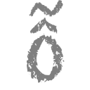
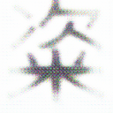
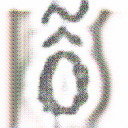
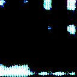

# Cross-Lingual Font Style Transfer

Cross-lingual font style transfer from English fonts to Chinese characters.

[Final report](https://github.com/pyliaorachel/cross-lingual-font-style-transfer/blob/master/cs231n-final-report.pdf)

[Poster](https://github.com/pyliaorachel/cross-lingual-font-style-transfer/blob/master/cs231n-poster.pdf)

## Methods

- Neural Style Transfer
    - [A Neural Algorithm of Artistic Style, Gatys et al.](https://arxiv.org/pdf/1508.06576v2.pdf)
- Image Transformation Network
    - [Perceptual Losses for Real-Time Style Transfer and Super-Resolution, Johnson et al.](https://arxiv.org/pdf/1603.08155.pdf)
- CycleGAN
    - [Unpaired Image-to-Image Translation using Cycle-Consistent Adversarial Networks, Zhu et al.](https://arxiv.org/pdf/1703.10593.pdf)

## Usage 

Run `python -m xxx -h` for detailed usage of each script and its options.

```bash
# Create virtual environment
$ conda env create -f environment.yml
$ conda activate style_transfer

# Run
## Neural style transfer
$ python -m project.src.style_transfer.neural_style_transfer.train --content PATH_TO_CONTENT_IMAGE --style PATH_TO_STYLE_IMAGE --output PATH_TO_OUTPUT_IMAGE --imsize IMAGE_SIZE --epochs EPOCHS --log-epochs LOG_EPOCHS

## Image Transformation Network 
$ python -m project.src.style_transfer.itn.train --dataset PATH_TO_TRAIN_SET_DIR --style PATH_TO_STYLE_IMAGE --output-model PATH_TO_OUTPUT_MODEL --imsize IMAGE_SIZE --epochs EPOCHS --batch-size BATCH_SIZE --log-epochs LOG_EPOCHS --save-epochs SAVE_EPOCHS
$ python -m project.src.style_transfer.itn.eval --dataset PATH_TO_EVAL_SET_DIR --model PATH_TO_MODEL --imsize IMAGE_SIZE --output-dir OUTPUT_DIR

## CycleGAN 
### Remember to turn on visdom server first:
$ visdom # open http://localhost:8097/

### Then run:
$ python -m project.src.style_transfer.cyclegan.train \
    --content-dataset PATH_TO_CONTENT_TRAIN_SET_DIR --style-dataset PATH_TO_STYLE_TRAIN_SET_DIR \
    --imsize IMAGE_SIZE --exp-name EXPERIMENT_NAME \
    [--epochs EPOCHS] [--batch-size BATCH_SIZE] [--lr LEARNING_RATE] [--decay-epoch DECAY_EPOCH] [--d-steps D_STEPS] [--cuda]
$ python -m project.src.style_transfer.cyclegan.eval \
    --dataset PATH_TO_EVAL_SET_DIR --imsize IMAGE_SIZE --img-nc IMAGE_NUM_CHANNELS --exp-name EXPERIMENT_NAME --epoch EPOCH
    [--cuda] [--show]
```

## Sample Output

### Neural Style Transfer

||Style|Content|Transfered|
|:-:|:-:|:-:|:-:|
|Normal||||
|Font||||

## Feature Comparisons

For more details, refer to Section 5.3 and 5.4 in the [final report](https://github.com/pyliaorachel/cross-lingual-font-style-transfer/blob/master/cs231n-final-report.pdf).

### CycleGAN

#### Image Cropping & PatchGAN

Image data are cropped before feeding into the discriminators to pervent them from learning that in general Chinese characters have more dark pixels than English characters in the images. We cropped at center for English characters (style) and cropped randomly at anywhere for Chinese characters (content).

[PatchGAN](http://openaccess.thecvf.com/content_cvpr_2017/papers/Isola_Image-To-Image_Translation_With_CVPR_2017_paper.pdf) is a similar technique which captures local structures of an image for discriminator to differentiate. We did not combine it with image cropping since the image will be too small and patches will be meaningless.

Here are some intermediate results after training the model for a few iterations.

||Style|Content|Transfered (Content)|Transfered(Style)|
|:-:|:-:|:-:|:-:|:-:|
|Without Cropping|||||
|With Cropping|||||
|PatchGAN|||||

#### Content Loss

After training for longer, we found that the transfered images tend to white out, i.e. the pixel values are very close to `255` everywhere. While the pixels that are not `255` do encode the information of the content (and hence the recovered image can be very close to the original one), we would like the transfered image to also look not too different from the original content image.

Hence another content loss is introduced, which the early layer outputs from the `X2Y` generator and `Y2X` generator are enforced to be close to each other.

Here are some intermediate results after training the model for one epoch. We have pulled the non-255 pixels down to zero to show the content of the transfered images. The first two rows use the output from the third conv block as the content feature. The last two rows use the output from the first conv block, i.e. enforces lower level details to be closer. The last row with a lower loss weight loosens the enforcement.

||Style|Content|Transfered|Transfered (contrast)|Recovered|
|:-:|:-:|:-:|:-:|:-:|:-:|
|Without Content Loss||||||
|With Content Loss (conv3, loss weight 1)||||||
|With Content Loss (conv1, loss weight 1)||||-||
|With Content Loss (conv1, loss weight 0.5)||||-||

## References

- [Neural Artistic Style Transfer: A Comprehensive Look](https://medium.com/artists-and-machine-intelligence/neural-artistic-style-transfer-a-comprehensive-look-f54d8649c199)
- [GitHub: aitorzip/PyTorch-CycleGAN](https://github.com/aitorzip/PyTorch-CycleGAN)
- [GitHub: soumith/ganhacks](https://github.com/soumith/ganhacks)
